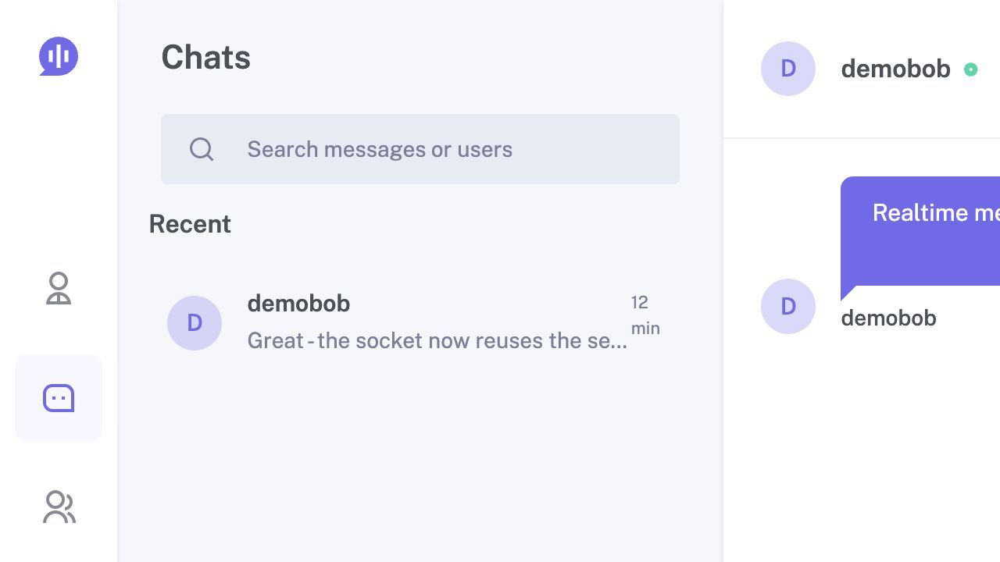
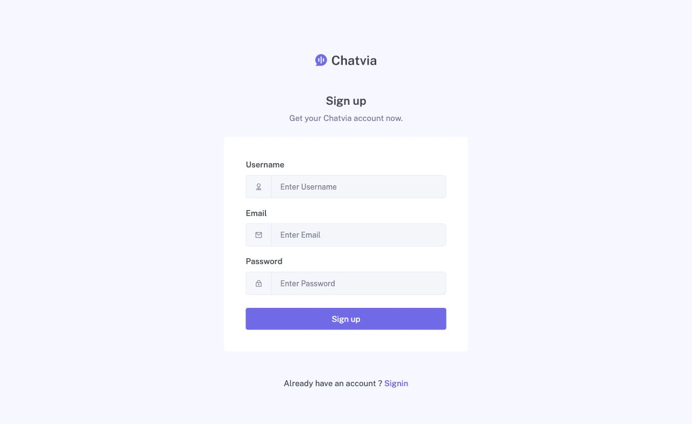

# Realtime Chat Platform

Express, Socket.IO ve MySQL ile geliştirilmiş, session tabanlı kimlik doğrulama kullanan gerçek zamanlı sohbet uygulaması.

## Özellikler

- Gerçek zamanlı bire bir mesajlaşma
- Kayıt, giriş ve kalıcı MySQL session yönetimi
- HTTP ve Socket.IO için ortak, `httpOnly` cookie tabanlı kimlik doğrulama
- Kişi arama, arkadaşlık isteği ve sohbet listesi
- Okundu bilgisi ve açık/koyu tema tercihi
- Controller / service / route katman ayrımı
- Otomatik veritabanı migration'ları
- Unit ve integration testleri
- Tek komutla Docker Compose kurulumu

## Ekran görüntüleri

### Sohbet ekranı



### Kayıt ekranı



## Hızlı başlangıç: Docker Compose

Gereksinimler: Docker Engine ve Docker Compose v2.

```bash
git clone https://github.com/Muhammed-Ozberk/realtime-chat-platform.git
cd realtime-chat-platform
cp .env.example .env
docker compose up --build
```

Uygulama `http://localhost:8080`, health endpoint'i ise `http://localhost:8080/health` adresinde açılır. Compose şunları birlikte kurar:

- `app`: Node.js 22 üzerinde Express + Socket.IO uygulaması
- `mysql`: MySQL 8.4 ve kalıcı `mysql_data` volume'u

İlk açılışta migration'lar otomatik çalışır. Servis durumunu kontrol etmek için:

```bash
docker compose ps
docker compose logs -f app
```

Servisleri durdurmak için `docker compose down` kullanın. Veritabanı volume'unu da silmek isterseniz bunun geri alınamaz olduğunu göz önünde bulundurarak `docker compose down -v` çalıştırabilirsiniz.

## Yerel geliştirme

Gereksinimler:

- Node.js 22+
- MySQL 8+

```bash
npm ci
cp .env.example .env
npm start
```

Uygulama başlamadan önce MySQL'de `.env` içindeki `DB_NAME` değerine karşılık gelen veritabanını oluşturun. Başlangıç süreci bağlantıyı doğrular, bekleyen migration'ları uygular ve ardından HTTP/Socket.IO sunucusunu açar.

### Ortam değişkenleri

| Değişken | Varsayılan | Açıklama |
| --- | --- | --- |
| `PORT` | `8080` | Uygulama portu |
| `DB_HOST` | `127.0.0.1` | MySQL sunucusu |
| `DB_PORT` | `3306` | MySQL portu |
| `DB_NAME` | `realtime_chat` | Veritabanı adı |
| `DB_USER` | `root` | Veritabanı kullanıcısı |
| `DB_PASSWORD` | boş | Veritabanı parolası |
| `SESSION_SECRET` | yalnızca development fallback'i | Session imzalama sırrı; production'da zorunlu |
| `SESSION_COOKIE_NAME` | `realtime_chat.sid` | Session cookie adı |
| `SESSION_MAX_AGE_MS` | `3600000` | Session süresi (ms) |
| `COOKIE_SECURE` | `false` | HTTPS üzerinde production için `true` olmalı |
| `TRUST_PROXY` | `false` | TLS sonlandıran reverse proxy arkasında `true` olmalı |

Production ortamında güçlü ve rastgele bir `SESSION_SECRET` kullanın; HTTPS ile birlikte `COOKIE_SECURE=true` ve uygun proxy yapılandırmasını etkinleştirin.

## Mimari

```text
routes/       URL ve middleware eşlemesi
controllers/  HTTP girdisi, durum kodu ve view/JSON yanıtları
services/     İş kuralları ve veri erişimi
models/       Sequelize modelleri
migrations/   MySQL şema değişiklikleri
helpers/      Passport, Socket.IO ve listeleme yardımcıları
test/         Unit ve integration testleri
```

İstek akışı `route → controller → service → model` şeklindedir. Bu ayrım HTTP katmanını iş kurallarından ayırır ve servislerin sahte bağımlılıklarla unit test edilmesini sağlar.

## Socket kimlik doğrulaması

Socket.IO artık JWT'yi URL query string'inde veya `sessionStorage` içinde taşımaz. HTTP login akışının ürettiği imzalı, `httpOnly`, `sameSite=lax` session cookie'si Socket.IO handshake sırasında aynı `express-session` middleware'i tarafından okunur.

Bağlantı kabul edildikten sonra kullanıcı yalnızca kendi kullanıcı kanalına katılır. Her `sendMessage` olayında sunucu, gönderenin ilgili odanın katılımcısı olduğunu veritabanından yeniden doğrular ve mesajı yalnızca karşı katılımcının kanalına iletir.

## Testler

```bash
npm test
npm run test:unit
npm run test:integration
```

Test kapsamı şunları içerir:

- Kayıt servisinde benzersiz kullanıcı ve parola hashleme davranışı
- API doğrulaması ve oturum kullanıcısının service katmanına aktarılması
- Session kullanıcısı olan/olmayan Socket.IO handshake'leri
- HTTP session cookie'sinin gerçek Socket.IO istemcisiyle tekrar kullanılması

## Faydalı komutlar

| Komut | Açıklama |
| --- | --- |
| `npm start` | Uygulamayı başlatır |
| `npm test` | Tüm testleri çalıştırır |
| `npm run db:migrate` | Migration'ları CLI üzerinden çalıştırır |
| `docker compose up --build` | MySQL ve uygulamayı kurup başlatır |
| `docker compose logs -f app` | Uygulama loglarını izler |

## Lisans

Bu proje [MIT Lisansı](LICENSE) ile lisanslanmıştır.
